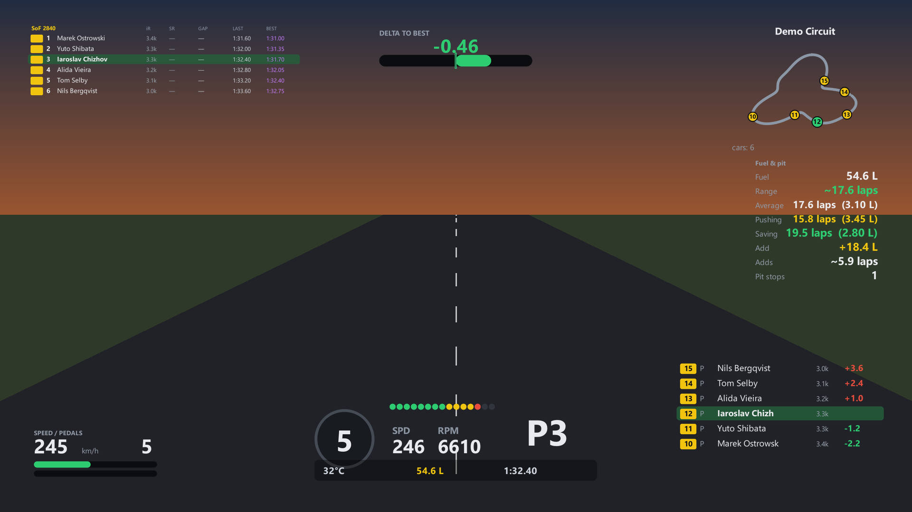

# Race Engineer for iRacing

A race engineer that runs on your own machine: a dashboard for the second
screen, 44 configurable overlays on top of the game, lap history that survives
between sessions, and an analysis of the stint in plain words.

No subscription, no cloud, no keys to anyone else's service. The data stays
on the PC that produced it.



## What it does

| | |
|---|---|
| **Overlay** | 44 widgets over the game — fuel, delta, standings, relative, track map, tyre temps, spotter, blind spot, lap log. Each one is tuned on its own: colour, size and font of every number. |
| **Dashboard** | 63 cards across 6 tabs (Solo, Endurance, Setup, Records, Strategy, Race analysis) on the second screen. |
| **History** | Every valid lap is resampled onto a distance grid and written to disk, with the conditions it was driven in. Progress shows across dates, not one drive. |
| **Analysis** | Corner by corner: the lap is split at its own speed minima, each corner compared against your reference lap, and the loss explained — braked earlier, lower apex speed, later back to throttle. After a stint a local model adds the setup side. |
| **Endurance** | A full team stint plan: who drives when, in race time and in each driver's own clock, with laps and fuel per stint. |

Nothing is smoothed. Raw values at a high refresh rate — smoothing hides
exactly what you open the numbers for.

## Requirements

- **Windows 10 or 11**, on the machine where iRacing runs. The telemetry SDK
  is a Windows memory-mapped file; there is no way around that.
- **iRacing** in windowed or borderless mode, not exclusive fullscreen —
  an overlay cannot draw over an exclusive fullscreen surface.
- **Python 3.12**.
- Optional: [Ollama](https://ollama.com) for the stint analysis. Without it
  everything else still works; only the written analysis is unavailable.

## Getting started

```bash
git clone https://github.com/YarRace/iracing-race-engineer
cd iracing-race-engineer
python -m venv .venv
.venv\Scripts\activate
pip install -r requirements.txt
```

Then one command:

```bash
python launcher.py --start
```

It starts the engineer, waits until it actually answers, and only then opens
the overlay. The order matters: an overlay opened before the server shows a
red dot and empty widgets, which is exactly what makes people think the thing
is broken.

To run the two halves yourself:

```bash
python run.py              # reads the sim, serves the dashboard on :8000
python overlay_app.py      # the settings window with the live preview
```

On Windows `start.bat` does the launcher with one double-click.
`start-demo.bat` runs the dashboard on demo data with no sim at all.

If the overlay panel shows a red dot and every widget is empty, `run.py` is
not running. That is the first thing to check.

## The analysis

Local by default, through Ollama:

```bash
ollama pull qwen2.5:7b
```

To use Claude instead:

```bash
set IRE_LLM=claude
set ANTHROPIC_API_KEY=...
```

## How it is put together

Seven modules under `src/ire/`, all local:

1. **collector** — pyirsdk → one normalised telemetry frame, plus session
   identity, standings, relative, damage and the track map built from your
   own laps.
2. **metrics** — deterministic symptoms from that frame: tyres, balance,
   suspension, inputs, consistency, fuel strategy. This is the tested core.
3. **storage** — SQLite history and gzipped per-lap telemetry in `data/`.
4. **explainer** — symptoms plus setup → the written analysis.
5. **setup** — reads the car setup from the SDK and writes a `.sto` file.
   The original is never touched.
6. **dashboard** — FastAPI, 16 API endpoints, plus the project site
   (`/about`, `/catalog`, `/download`, `/news`).
7. **orchestrator** — ties the live loop together.

The overlay itself lives in `overlay/` (PySide6): `widgets.py` holds all 44,
`panel.py` is the three-column settings window, `preview.py` renders the live
preview inside it.

## Building a standalone app

If you would rather not keep Python around:

```bash
pip install pyinstaller
python tools/build_exe.py --zip --shortcuts
```

You get three folders in `dist/` — the engineer, the overlay and the
launcher. Keep them next to each other: the launcher looks for the other two
as siblings. They are a folder each,
not a single file. One-file builds unpack 120 MB into a temp directory on
every launch and trip antivirus heuristics doing it. `--zip` packs each
folder into one archive to hand around; `--shortcuts` puts both on your
desktop so you never go looking in `dist/` again.

Your `data/` lives next to the app, never inside it, so replacing the folder
with a newer build never touches your lap history or overlay layout.

## Tests

```bash
python -m pytest -q
```

262 tests, no sim required. The Qt ones run offscreen, and CI runs the same
suite on Windows for every push.

## Tools

```bash
python tools/build_catalog.py       # widget/card catalogue → data/catalog.json
python tools/render_widgets.py      # a PNG of every widget on demo data
python tools/render_panel.py        # screenshots of the settings window
python tools/render_dashboard.py    # screenshots of the dashboard
python tools/render_hero.py         # the overlay-over-the-game hero image
python tools/overlay_audit.py       # does every widget survive empty data
python tools/make_icon.py           # the app icon, drawn in code
python tools/refresh_assets.py      # all of the above, in the right order
```

`refresh_assets.py` is the one to remember — the catalogue has to be rebuilt
before the screenshots, and forgetting that leaves the site a version behind
the code. A test catches the drift, but the command avoids it.

## Where things are

- `data/` — your history, lap telemetry, track maps and overlay config.
  Not in git, and not to be deleted.
- `docs/news/` — the changelog, rendered at `/news` with an RSS feed.
- `docs/widgets/`, `docs/panel/`, `docs/dashboard/` — generated screenshots.

## Status

Works end to end and is used in real races. Nothing is published as a
download yet — you either run it from source or build it yourself with the
command above.
